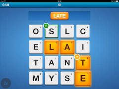

#Boggle
---

Intro
---
- Command line based Boggle-like game that gives you 60 seconds to guess as many more than 3 letter connecting words on the board
- Connecting words can be created by moving in the following directions
  - Across and Backwards
  - Up and Down
  - Diagonally and reverse diagonally
- After 60 seconds are up, all the words that were matched on the wordlist are displayed. Your guesses count is also listed and the number of words possible on the board is listed.

Play
---
- To play simply run `python boggle.py`.
- Application has been tested with python 2 and 3
- The puzzle is predefined and matches the one below.
- Puzzle can be changed by a new state to line `153` in the form of `state = 'oslc elai tant myse'`

- The wordlist is obtained from someone who kindly had a copy of [openbsd-src online from their word dict. It is 2.3MBs ](https://github.com/bluerise/openbsd-src/blob/master/share/dict/web2)

Interesting Tidbits
---
Here are some facts and timings about the application. All run on a 2013 MacBook Air.

- 234979 words on list
- 11559042 naive possibilities
- 3:15 minutes to traverse 4x4 combo possibilities

with optimization and word sets
- 5 seconds to parse the word set
- 736623 possible word_branches
- 488 - pruned real words
- 452 - filtered to words >3

Timing for full application
```
real	0m4.574s
user	0m3.865s
sys	0m0.417s
```

Time for just load_words.
```
len(load_words())
CPU times: user 2.41 s, sys: 252 ms, total: 2.66 s
Wall time: 2.85 s
```

LICENSE
---
MIT
